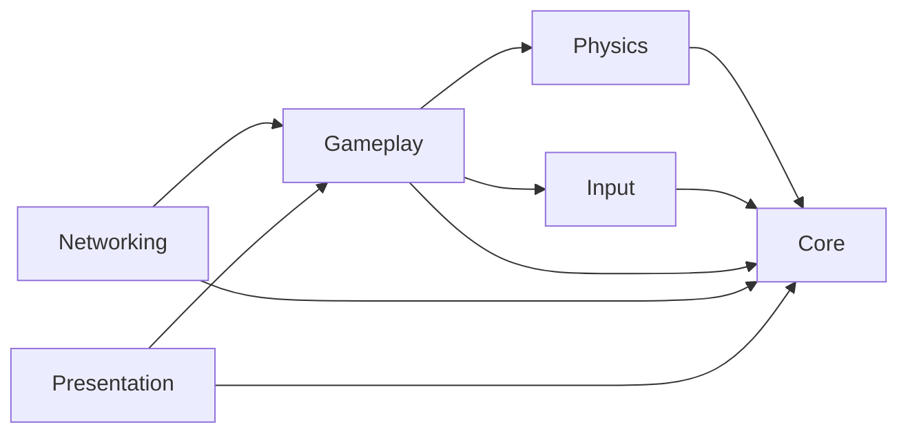

# Pool Table architecture

Pool Table is being migrated from a legacy Unity project into explicit modules. The migration is incremental: the existing gameplay remains in Unity's predefined `Assembly-CSharp` assembly until each system is deliberately refactored into a modern module.

## Runtime modules

| Assembly | Responsibility | Allowed runtime dependencies |
| --- | --- | --- |
| `PoolTable.Core` | Domain primitives, immutable match state, rules contracts, shared value types | None; Unity engine references are disabled |
| `PoolTable.Physics` | Billiards simulation adapters, collision facts, calibration and shot simulation | `Core` |
| `PoolTable.Input` | Player intent and Unity Input System adapters | `Core` |
| `PoolTable.Gameplay` | Match orchestration and gameplay use cases | `Core`, `Physics`, `Input` |
| `PoolTable.Networking` | Host-authoritative session and replication adapters | `Core`, `Gameplay` |
| `PoolTable.Presentation` | Cameras, UI, audio and visual feedback adapters | `Core`, `Gameplay` |

The dependency graph is intentionally one-way:

`Core` must remain usable as pure C# so rules and match-state logic can be tested without Unity runtime dependencies. Higher-level modules may use Unity where their adapter responsibilities require it.

## Legacy transition

The current scripts under `Assets/Scripts` remain in `Assembly-CSharp`. Issue #22 establishes the destination boundaries only; it does not move legacy MonoBehaviours or change scene serialization.

Future architecture issues should move behavior behind these boundaries in small vertical steps. New dependencies must follow the graph above instead of adding reverse references or cycles.

## Input System transition

`PoolTable.Input` owns the modern player-input boundary and references Unity's Input System package directly. `MouseInputReader` is the first adapter: it exposes raw pointer delta plus primary- and secondary-button state as an immutable snapshot without making aiming, shot-power, spin, camera, or match-state decisions.

The project now runs with the new Input System backend only. Legacy gameplay remains in `Assembly-CSharp`, which deliberately does not auto-reference the modern asmdefs, so `Assets/Scripts/Input/LegacyMouseInput.cs` is a temporary compatibility shim that reads the same Input System mouse device while those MonoBehaviours are migrated in later Phase 5 issues. Its `0.1` pointer-delta scale preserves the previous `Mouse X` / `Mouse Y` Input Manager sensitivity. New gameplay code must use `PoolTable.Input` instead of extending this compatibility shim.

## Scene composition

`PoolTableSceneCompositionRoot` is the scene-level bootstrap for explicitly wired runtime adapters. It lives in `PoolTable.Presentation` and receives its scene dependencies through serialized references.

The first migrated vertical slice is collision audio: the composition root injects the scene `SoundManager` into each `PlaySoundOnBallCollision` below the serialized `Balls` root. Collision audio therefore no longer acquires its dependency through a static `SoundManager.Instance` service locator. Ball-to-ball impact playback uses typed `BallIdentity` components rather than legacy tags and selects one stable emitter per ball pair so mirrored PhysX callbacks do not double the sound. `BallImpactAudioModel` projects relative velocity onto the contact normal, then combines that normal closing speed with the two Rigidbody masses to compute reduced-mass collision energy. Tangential velocity therefore cannot make a glancing contact sound like a head-on strike. The model applies an explicit silence floor, then maps energy to amplitude and the existing impact-clip bank. The calculation stays in Presentation and consumes local collision facts, preserving the documented assembly direction without adding a Presentation-to-Physics dependency.

Rail, pocket, and cue-strike audio follow the same dependency direction through explicit gameplay facts. `BallRailCollisionResponse` exposes the normal closing speed of its resolved custom rail response; `PoolTableImpactEventSource` lives in Gameplay, converts that Physics observation into rail-impact energy, forwards typed `PocketCaptureVolume.BallCaptured` observations, and forwards `ShotPowerController.CueStrikeApplied` only when the queued cue strike is physically committed in `FixedUpdate`. Presentation consumes those three event streams through `PoolTableImpactAudioPresenter`, while `ImpactLayerAudioModel` owns the deterministic energy/power-to-volume and pitch mapping. `SoundManager` assigns overlapping effects to pooled `AudioSource` voices so pitch remains local to each active impact instead of being overwritten by the next collision. The scene composition root performs the subscriptions and owns their lifetime. Presentation still has no reference to `PoolTable.Physics`.

The migration remains incremental. Legacy `GameManager` and `PlayersStateManagement` globals still exist in `Assembly-CSharp` and must be replaced by later focused issues rather than being hidden behind the new composition root.

## Typed ball identity

`PoolTable.Core` owns the Unity-independent `BallId` value type and `BallGroup` domain enum. `BallId` accepts the standard rack numbers 0 through 15, identifies the cue and eight balls explicitly, and classifies balls 1-7 as solids and 9-15 as stripes.

`PoolTable.Gameplay` exposes that domain identity to Unity through `BallIdentity`. Each billiard ball in `PoolTable.unity` serializes one ball number and exposes the corresponding typed `BallId` and `BallGroup` at runtime.

Legacy `white`, `black`, `filled`, and `striped` tags remain temporarily as a compatibility layer for existing gameplay scripts. PlayMode validation requires those tags to agree with the typed identity while later focused issues migrate tag consumers to the domain model.

## Immutable match state

`PoolTable.Core.Match` owns the Unity-independent state of a two-player match. `MatchPlayerId` identifies the two seats, `MatchPlayerState` stores each player's optional solids/stripes assignment, and `MatchPhase` distinguishes break, open-table, assigned-groups, and finished phases.

`MatchState` is immutable. Turn changes, phase changes, and group assignment return a new state while leaving the previous value untouched. Its constructor enforces structural invariants such as fixed player identities and complementary group assignments so future rules, gameplay orchestration, and network replication can share one valid domain representation. A `Finished` state must carry a `MatchResult` with distinct winner/loser seats and one or more validated `MatchEndReason` flags; non-finished states cannot carry a result, and turns cannot change after the match has finished.

Ball-in-hand is part of that immutable domain state rather than a gameplay boolean. `BallInHandState` records the current recipient and a `CueBallPlacementArea`: standard fouls use `Anywhere`, while the explicit break-foul option uses `AboveHeadString`. An active recipient must always be the current player, and ball-in-hand cannot exist during `Break` or `Finished`. Active ball-in-hand construction is internal to `PoolTable.Core`, so higher-level assemblies cannot infer a restricted `AboveHeadString` state from the long-lived `OpenTable` phase or inject one into `MatchState`; they must obtain it through the rule transition that owns that consequence.

The legacy `GameManager` remains the active scene controller for now. Connecting it to `MatchState` is intentionally deferred to a focused migration issue so this domain slice does not mix state modeling with MonoBehaviour lifecycle, UI, or WPA rule resolution.

## Shot intent and observed facts

`PoolTable.Core.Shots` separates player commands from physics observations. `ShotIntent` records which match player is acting, a normalized table-plane `ShotDirection`, normalized shot power, and an optional legacy `CalledShot`. A call contains exactly the intended non-cue object ball and one stable `PocketId` from the table's six pockets. It contains no Unity input or physics types, so the same intent can later be produced by local input or a network client. Normal `Poche libre` group assignment and Tour ownership do not require or consume a call; the field remains temporarily for compatibility with rule slices that have not yet been migrated.

`ShotFacts` records what was actually observed after a shot: the first object-ball contact, each `PocketedBall` paired with the pocket that received it, the distinct balls that contacted a rail after first object-ball contact, and the balls driven off the table. It also exposes the derived ball-only `PocketedBalls` list so existing break, foul, and rail rules remain focused on the facts they need. Its collections are defensively copied and exposed read-only so WPA rule evaluation can consume a stable snapshot. A ball cannot be both pocketed and driven off the table in the same shot. `WasPocketedIn` and `WasDrivenOffTable` provide deterministic queries for later rule composition.

Legacy `PlayersShootState`, `WhiteBallCollision`, and `BallStateManager` remain unchanged for now. The legacy `Pocket` script also remains as source compatibility, but `PoolTable.unity` no longer uses the global `pocket_destroy` trigger as capture authority. Later focused issues will translate Unity input and call selection into `ShotIntent`, aggregate scene observations into complete `ShotFacts`, and evaluate those facts through the Core rules layer.

## Match rules core

`PoolTable.Core.Rules` contains Unity-independent rule evaluators that consume immutable domain facts. `LegalBreakRule` remains as compatibility metadata from the earlier WPA-oriented implementation: it reports whether an object ball was pocketed or four distinct object balls reached a rail. `MatchShotResolver` no longer uses that four-rail result to decide Poche libre break ownership or group assignment.

The product break contract has no minimum power, spread, or rail-count requirement. Remaining contact-foul and `Deux coups` lifecycle semantics are handled by the dedicated match-state work rather than by `LegalBreakRule`.

`OpenTableRule` owns the `Break` to `OpenTable` transition. `PlayerGroupAssignmentRule` then closes an open table only when the current player is explicitly reported to have legally pocketed a solids or stripes ball. The acting player receives that ball's group, the opponent receives the complementary group, and the immutable match state transitions to `GroupsAssigned`. Cue and eight balls cannot assign a group.

Direct phase and group mutation helpers on `MatchState` are internal to `PoolTable.Core`, so higher-level assemblies must use the rule layer instead of bypassing these domain transitions. Foul detection and group assignment remain separate rule slices, while legacy called-shot validation is compatibility data and does not control normal `Poche libre` Tour progression.

`OpenTableRule` owns the next match-state transition. After a completed break, `MatchShotResolver` first moves the immutable `MatchState` from `Break` to `OpenTable`; if exactly one solids/stripes family was pocketed, `PlayerGroupAssignmentRule` immediately assigns that family to the breaker. If both families were pocketed, the table remains open and control passes. `MatchState.IsTableOpen` exposes the open-table state without forcing callers to compare phase enums themselves.

Group assignment, legal first-contact evaluation, foul handling, and turn resolution remain separate rules. The authoritative behavior follows the project `Poche libre` contract rather than called-shot or minimum-rail break rules.

`LegalFirstContactRule` validates the first object-ball contact against immutable match state and an `ObjectBallTableSnapshot` captured before the shot. During the break any object-ball may be contacted first. On an open table, solids or stripes may be contacted first and the 8-ball is never a legal first contact because no shooter group has been assigned yet. Once groups are assigned, the shooter must contact their own group first until it is cleared, after which the 8-ball becomes the required first contact.

`ObjectBallTableSnapshot` defensively copies and validates the object balls present before a shot. This keeps rule evaluation independent from Unity scene queries and gives future foul resolution and host-authoritative networking a stable description of table occupancy.

`RailOrPocketRequirementRule` evaluates the rail-or-pocket requirement for normal shots. In `OpenTable` and `GroupsAssigned` phases, pocketing any ball satisfies this narrow requirement; otherwise an object-ball must be contacted and at least one ball, including the cue-ball, must reach a rail after that contact. Break shots are outside this evaluator and are resolved through the dedicated break orchestration path.

This evaluator does not decide whether the complete shot is legal. A cue-ball scratch can satisfy the rail-or-pocket condition because a ball was pocketed while still being a foul under the separate scratch rule. Wrong-first-ball, scratch, ball-in-hand, called-shot, and turn resolution remain separate rule slices.

`FoulResolutionRule` composes the first-contact and rail-or-pocket evaluators for normal shots and adds cue-ball scratch plus cue/object-ball off-table detection. Its `ShotFoul` flags preserve simultaneous faults instead of collapsing them into one reason. A no-object-contact shot is reported once rather than also inventing a rail-after-contact foul, while a wrong first contact can legitimately coexist with a missing rail/pocket foul.

During the break this resolver reports directly observable scratch/off-table fouls without applying normal-shot first-contact or rail/pocket rules. Gameplay composes those facts with the Poche libre break result; the future Tour/Deux coups state work owns the remaining entitlement lifecycle. The physics observation layer is responsible for producing the corresponding `ShotFacts`; the Core only evaluates those facts.

`BallInHandRule` applies the ball-in-hand consequence without introducing Unity physics concerns. Standard fouls advance to the incoming player and grant placement anywhere on the playing surface. The authoritative Poche libre break path also grants placement anywhere after a cue-ball scratch/off-table foul, after any single-family assignment has been preserved. The older above-head-string break helper remains only for compatibility with earlier rule slices and is not used by `MatchShotResolver`. Once gameplay confirms a valid cue-ball placement, the rule consumes the ball-in-hand state while preserving the same turn and match phase. Physical placement coordinates, overlap checks, and table-boundary validation remain gameplay/physics responsibilities.

`EightBallRule` owns terminal Poche libre 8-ball resolution, including the break. It composes `FoulResolutionRule` from the same immutable shot facts and pre-shot table snapshot instead of trusting a caller-supplied foul result. Pocketing the 8-ball on the break, pocketing it before the shooter's assigned group was already cleared, pocketing it with a foul, or driving it off the table loses immediately. After the assigned group is cleared, pocketing the 8-ball in any pocket wins without a declaration. Legacy called-shot data cannot change the terminal result; the old uncalled-pocket end-reason enum value is retained only for source compatibility and is no longer emitted by this rule.

## Gameplay shot orchestration

`PoolTable.Gameplay.Match.MatchShotResolver` is the vertical integration boundary between observed shot data and authoritative match progression. It accepts only the immutable `MatchState`, `ShotIntent`, `ShotFacts`, and pre-shot `ObjectBallTableSnapshot`; it has no dependency on `GameManager`, `PlayersStateManagement`, scene tags, or other legacy globals.

The resolver owns rule ordering rather than reimplementing individual Core rules. It resolves terminal 8-ball outcomes first, so an 8-ball loss on the break takes precedence over group assignment, scratch, ball-in-hand, or any other non-terminal consequence. For non-terminal normal shots it evaluates the composed foul result and applies standard foul ball-in-hand when required. Clean `Poche libre` progression is derived from `ShotFacts`: on an open table, pocketing exactly one family assigns that family and keeps control, while pocketing both families keeps the table open and ends the Tour. After groups are assigned, pocketing only the shooter's group keeps control; opponent-only pockets, a `Coup mixte`, and legal no-pocket shots end the Tour without inventing a foul. Legacy called-shot success may still be reported as compatibility metadata, but it does not control normal or terminal Poche libre outcomes. Input validation still rejects observed contacts, pockets, and off-table object balls that were not present in the pre-shot snapshot, which makes the boundary suitable for future local and network adapters.

Break shots now resolve directly. A clean single-family pocket assigns that family and keeps the breaker at the table; mixed families keep the table open and pass control; a clean no-pocket break opens the table and passes control. A cue-ball scratch/off-table foul preserves any single-family assignment, passes control, grants ball-in-hand anywhere, and sets `ShotResolution.GrantsTwoShotEntitlement` so issue #126 can persist the `Deux coups` state without duplicating break policy. `BreakEvaluation` remains diagnostic compatibility metadata and `RequiresBreakFollowUp` is false for authoritative break resolutions.

Future physics code should produce observations that can be translated into `ShotFacts`; it should not decide WPA outcomes itself. Presentation and networking adapters consume the `ShotResolution` / resulting `MatchState` from Gameplay instead of reading legacy singleton state.

## Gameplay aiming

`PoolTable.Gameplay.Aiming.AimingState` owns the canonical aim as a normalized `ShotDirection`. It is table-plane data rather than a value inferred from a cue transform, so future shot-power, spin, controller, and networking code can consume the same explicit direction.

`CueAimingController` is the Unity scene adapter. It reads horizontal pointer delta through `PoolTable.Input.MouseInputReader`, rotates the planar aiming state around the table vertical axis, and uses that direction to orbit the cue around the cue ball. The cue transform then looks at the cue-ball center so scene geometry can keep its vertical offset without contaminating the planar gameplay direction. The `0.1` yaw scale preserves the effective sensitivity of the legacy Input System compatibility shim. While the secondary-button spin gesture is active, aiming ignores pointer movement so one physical input delta cannot change both aim and cue-tip contact.

The legacy `PlayersStateManagement` assembly does not become a dependency of Gameplay. During migration it stores the modern controllers only as generic Unity `Behaviour` references and transfers authority between them: play enables aiming and spin selection, shoot enables shot power, and spectate disables all three.

## Gameplay shot power

`PoolTable.Gameplay.Shots.ShotPowerState` owns the local cue pullback in meters and derives normalized shot power from that bounded distance. It contains no Unity input or scene dependencies, so the power curve can be tested independently and later fed by mouse, controller, or network-facing adapters without duplicating the domain state.

`ShotPowerController` is the Unity scene adapter. It reads vertical pointer delta through `PoolTable.Input.MouseInputReader`, preserves the previous effective `0.1` pointer sensitivity, moves the cue backward from its aiming rest pose, and commits exactly one shot when the primary button is released with usable power. Direction comes from `CueAimingController.Direction`; the configured normalized power is mapped to the existing 6.6666667 m/s maximum shot-speed baseline; selected cue-tip contact comes from `CueBallSpinController`; and `PoolTable.Physics.Cue.CueBallStrikeModel` performs the physical linear/angular velocity conversion on the next fixed physics step.

The legacy shoot state no longer samples pointer delta or applies force. It only enables the modern shot-power adapter, locks the legacy camera during the temporary migration, resets legacy collision flags, and advances to spectating after the adapter commits and disables itself. This leaves one authoritative shot path while the remaining legacy state machine is removed incrementally.

## Gameplay cue-ball spin

`PoolTable.Gameplay.Shots.CueBallSpinState` owns the currently selected normalized cue-tip contact point. Pointer adjustments are accumulated inside the same unit disc enforced by the Core `CueBallSpin` contract, so Gameplay cannot hand an invalid contact point to Physics.

`CueBallSpinController` is the Unity scene adapter for mouse spin selection. Holding the secondary mouse button and moving the pointer adjusts side and vertical contact without rotating the aim. The selected value survives the transition from aiming into shot-power input, is read by `ShotPowerController` when the shot is queued, and is reset to center only after the queued strike is physically committed in `FixedUpdate`. This keeps input selection, shot orchestration, and physical strike calculation in separate layers while making the selected spin part of the same authoritative local shot path.

## Gameplay ball-in-hand placement

`PoolTable.Gameplay.BallInHand.BallInHandPlacementGeometry` owns physical cue-ball placement legality in table-plane coordinates. It derives the playable center bounds from `BilliardsPhysicalSpecification`, enforces `AboveHeadString` on the negative-X head side, and rejects positions whose regulation cue-ball circle overlaps an active object ball. Core remains free of Unity geometry and continues to represent only the recipient and allowed placement area.

`BallInHandPlacementSession` is the domain-aware Gameplay boundary. It starts only from an active `MatchState` ball-in-hand, keeps the recorded recipient and placement area, and calls `BallInHandRule.CompletePlacement` only after the physical candidate is legal. This keeps the existing Core rule as the single authority for consuming ball-in-hand.

`BallInHandPlacementController` is the Unity scene adapter. Mouse pointer delta and controller action-axis input move the cue ball across the table plane while placement is active. Confirmation revalidates bounds and overlap, restores a captured cue ball through `BallPocketCapture.Restore`, clears linear/angular velocity, then disables the placement adapter. The current legacy player state machine temporarily references this controller as a generic `Behaviour`: a scratch starts placement instead of teleporting the cue ball, aiming/spin/shot-power adapters remain disabled while placement is active, and the legacy pocketed-ball bookkeeping is cleared after a successful modern placement. This bridge exists only while `GameManager` and the legacy player states still own the scene turn loop.

## Metric billiards scale

`PoolTable.Physics.Configuration.BilliardsPhysicalSpecification` is the authoritative dimensional reference for the new simulation. Physics world space uses the Unity convention of one world unit per meter. Regulation pool balls therefore use a 0.05715 m diameter and 0.028575 m radius, while the 9-foot reference playing surface is 2.54 m by 1.27 m.

The reference table-bed height is the midpoint of the WPA equipment range, 0.765175 m. Ball centers start one radius above that bed. The initial cue ball is placed on the head string and the object balls use a touching triangular rack whose apex is on the foot spot. These dimensions are data for later rigidbody, cloth, spin, rail, pocket, instrumentation, and host-authoritative networking work; those systems must not introduce a separate scene-unit conversion.

The legacy table asset is scaled and centered in `PoolTable.unity` so its existing tabletop collision bounds represent the 2.54 m x 1.27 m physical reference. The ball container itself stays at unit scale and every ball collider is validated at the regulation diameter. Exact cushion response and pocket geometry remain separate Phase 4 tasks rather than being inferred from the legacy mesh during this scale migration.

`BilliardsSimulationConfiguration` is the authoritative rigidbody/simulation baseline layered on those dimensions. Ball rigidbodies use a 0.17 kg mass, continuous dynamic collision detection, interpolation, and zero built-in linear/angular damping. The project physics baseline uses a 1 mm default contact offset, a lower sleep threshold, 12/4 solver iterations, and a 0.005 s fixed timestep. Legacy upward-velocity damping is expressed as a time-scaled retention factor so the move from the old 0.02 s timestep to 0.005 s preserves the same damping over a 20 ms interval instead of applying the old multiplier four times. The legacy cue controller expresses shot strength as a target velocity change in meters per second, so changing Rigidbody mass does not silently retune shot speed.

`BallClothResistance` owns the explicit ball-cloth motion model. The tabletop keeps a dedicated zero-friction PhysicMaterial, so native PhysX friction cannot add hidden translation/rotation coupling on top of the project model. While a supported ball is sliding, the model measures planar slip at the bottom contact point from both linear and angular velocity and applies a 1.962 m/s² kinetic-friction baseline. Translation and rotation are coupled with the solid-sphere inertia relation, which drives contact slip toward zero without overshooting it. If rolling is reached partway through a fixed step, the remaining time is evaluated with the 0.2 m/s² rolling-resistance baseline.

Rolling resistance updates both planar linear velocity and the matching horizontal angular velocity so the no-slip condition remains coherent as the ball slows. Vertical linear velocity remains owned by PhysX. Vertical-axis side spin is dissipated separately at a constant angular-deceleration baseline and clamps at zero, so it cannot reverse sign or disturb the planar sliding/rolling calculation. Billiard rigidbodies allow angular velocity up to 400 rad/s: regulation-radius rolling already requires about 70 rad/s at 2 m/s, while the supported maximum off-center cue strike can exceed the previous 200 rad/s ceiling. Cloth resistance is still applied only when an upward supporting contact comes from a collider explicitly marked with `ClothSurface`, so ball-to-ball, rail, and pocket contacts cannot accidentally receive cloth resistance. The sliding, rolling, and side-spin values are initial calibration baselines for later instrumentation.

`PoolTable.Core.Shots.CueBallSpin` carries cue-tip contact as normalized side/vertical coordinates inside a unit disc. A centered value is the default, which keeps existing shot intents backward compatible. `PoolTable.Physics.Cue.CueBallStrikeModel` maps that contact point onto a configurable fraction of the regulation ball radius and converts the cue's planar velocity change into angular velocity using the solid-sphere inertia relation. Positive vertical contact produces follow spin, negative vertical contact produces draw, and side contact produces vertical-axis spin. The strike model stays independent from mouse/controller selection; Phase 5 owns the player-facing spin controls and will feed this physics contract when the legacy cue controller is replaced.

Rail impacts use the same explicit-physics approach. `RailSurface` identifies the scene colliders that represent cushion contact, while their dedicated `RailSurface` PhysicMaterial keeps native PhysX bounce and friction at zero. `BallRailCollisionResponse` is the Unity adapter attached to each billiard ball: it converts Unity's collision-relative velocity convention into the incoming ball velocity expected by the pure response model and coalesces every marked rail collider reported for the same physics step. Contact normals from those colliders are accumulated into one manifold, so seams and pocket-jaw contacts receive one combined custom response instead of applying restitution once per collider. As each callback arrives, the adapter removes only the planar portion of that collider pair's native PhysX impulse and applies the incremental change in the combined custom manifold response, preserving unrelated simultaneous impulses and PhysX-owned vertical deflection. `RailCollisionResponseModel` deduplicates planar normals, applies the 0.82 normal restitution baseline plus a 0.2 tangential Coulomb-friction coefficient, and stabilizes the manifold until all contacted faces are non-approaching without reapplying tangential friction. Side-spin/contact-slip coupling uses the solid-sphere inertia relation. Vertical velocity remains owned by PhysX, and separating or invalid contacts are ignored. This keeps calibration values explicit and prevents Unity's material solver from applying a second hidden rail response.

Pocket capture now uses the same typed, explicit boundary. `PoolTable.Physics.Pockets.PocketCaptureLayout` maps the six stable `PocketId` values to metric table-space capture centers, while `BilliardsPhysicalSpecification` owns the trigger radius and below-bed depth. The capture center sits far enough below the playing surface that a regulation ball resting at bed height cannot overlap the trigger before it drops through a pocket mouth, so cushion-jaw contact alone cannot report a pocket.

`PoolTable.Gameplay.Pockets.PocketCaptureVolume` is the Unity trigger adapter. It resolves only rigidbodies carrying `BallPocketCapture`, which in turn requires the typed `BallIdentity`; no legacy ball tags or `GameManager` state participate. A successful capture emits one immutable `PocketedBall` containing the `BallId` and `PocketId`, stops the rigidbody, and removes the ball from active simulation without destroying its object. Capture is idempotent until `BallPocketCapture.Restore` is called, which preserves the cue-ball object for the later ball-in-hand placement flow. `PoolTable.unity` contains exactly six identified capture volumes and all 16 billiard balls carry the capture adapter. Complete shot-fact aggregation and simulation instrumentation remain separate follow-up work.

## Shot simulation instrumentation

Shot calibration is observed through an explicit Physics-layer instrumentation boundary. `RigidbodySimulationProbe` samples each active ball on fixed simulation steps and emits the Rigidbody physics position, linear velocity, angular velocity, and kinetic energy. Energy uses the same solid-sphere inertia model as the cue and cloth systems, so translational and rotational measurements share one physical convention. The probe records collision time, collision kind, relative impact speed, impulse magnitude, and contact position. Ball contacts are observed on both entry and persistent non-zero-impulse steps so impulse propagation through an already touching rack is preserved, while mirrored callbacks for the same ball pair and physics step are coalesced into one observation. Rail contacts from every marked collider in the same physics step are likewise coalesced into one observation, whose impulse is the net linear impulse applied by `BallRailCollisionResponse` after its custom planar restitution/friction correction rather than the replaced native PhysX planar impulse. Pending rail observations are flushed before a new recording begins, while the probe is still inactive, so collisions from the previous simulation step cannot cross the explicit shot boundary.

`ShotSimulationRecorder` owns capture lifetime. Callers explicitly begin and complete a shot instead of coupling instrumentation to the legacy shooting state machine. Completion returns an immutable `ShotSimulationReport` indexed by stable `BallId` values. Per-ball tracks expose ordered trajectory samples, traveled distance, peak energy, and the first sampled time at which both linear and angular motion are below the billiards stopped thresholds. The report also exposes shot-level distance, boundary/peak energy, and collision aggregates for calibration.

Physics does not depend on Gameplay identity. `PoolTable.Gameplay.Instrumentation.ShotSimulationInstrumentation` discovers the typed `BallIdentity` components under the scene's Balls root, maps their `BallId` values to the Physics probes, and exposes the explicit `BeginShot` / `CompleteShot` boundary to future gameplay orchestration. `PoolTableSceneCompositionRoot` keeps that scene dependency explicit. Instrumentation does not evaluate WPA rules, mutate `MatchState`, read legacy `GameManager` state, log files, drive presentation, or claim networking authority; future multiplayer remains host-authoritative and may use these reports for calibration and diagnostics rather than deterministic cross-machine simulation.

## Tests

`PoolTable.EditMode.Tests` and `PoolTable.PlayMode.Tests` explicitly reference all modern runtime assemblies. EditMode architecture tests validate the asmdef graph and the Unity-free `Core` boundary so accidental dependency changes fail early. Gameplay orchestration is exercised deterministically in EditMode, while the PoolTable scene PlayMode smoke builds a pre-shot snapshot from the real typed `BallIdentity` components and passes it through `MatchShotResolver` without relying on uncontrolled real-time PhysX outcomes.
