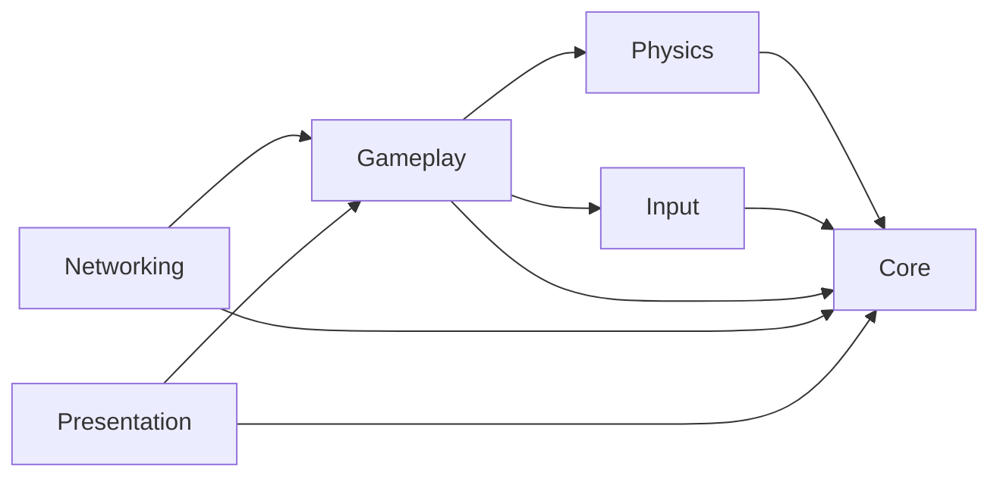

# Pool Table architecture

Pool Table is being migrated from a legacy Unity project into explicit modules. The migration is incremental: the existing gameplay remains in Unity's predefined `Assembly-CSharp` assembly until each system is deliberately refactored into a modern module.

## Runtime modules

| Assembly | Responsibility | Allowed runtime dependencies |
| --- | --- | --- |
| `PoolTable.Core` | Domain primitives, immutable match state, rules contracts, shared value types | None; Unity engine references are disabled |
| `PoolTable.Physics` | Billiards simulation adapters, collision facts, calibration and shot simulation | `Core` |
| `PoolTable.Input` | Player intent and Unity Input System adapters | `Core` |
| `PoolTable.Gameplay` | Match orchestration and gameplay use cases | `Core`, `Physics`, `Input` |
| `PoolTable.Networking` | Host-authoritative session and replication adapters | `Core`, `Gameplay` |
| `PoolTable.Presentation` | Cameras, UI, audio and visual feedback adapters | `Core`, `Gameplay` |

The dependency graph is intentionally one-way:

`Core` must remain usable as pure C# so rules and match-state logic can be tested without Unity runtime dependencies. Higher-level modules may use Unity where their adapter responsibilities require it.

## Legacy transition

The current scripts under `Assets/Scripts` remain in `Assembly-CSharp`. Issue #22 establishes the destination boundaries only; it does not move legacy MonoBehaviours or change scene serialization.

Future architecture issues should move behavior behind these boundaries in small vertical steps. New dependencies must follow the graph above instead of adding reverse references or cycles.

## Tests

`PoolTable.EditMode.Tests` and `PoolTable.PlayMode.Tests` explicitly reference all modern runtime assemblies. EditMode architecture tests validate the asmdef graph and the Unity-free `Core` boundary so accidental dependency changes fail early.
