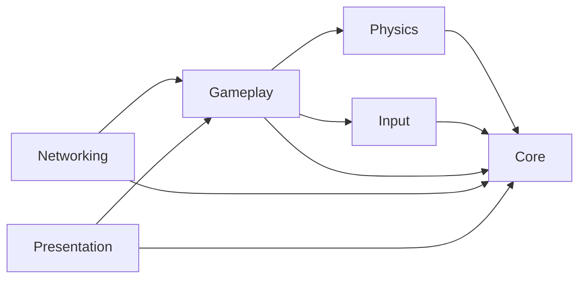

# Pool Table architecture

Pool Table is being migrated from a legacy Unity project into explicit modules. The migration is incremental: the existing gameplay remains in Unity's predefined `Assembly-CSharp` assembly until each system is deliberately refactored into a modern module.

## Runtime modules

| Assembly | Responsibility | Allowed runtime dependencies |
| --- | --- | --- |
| `PoolTable.Core` | Domain primitives, immutable match state, rules contracts, shared value types | None; Unity engine references are disabled |
| `PoolTable.Physics` | Billiards simulation adapters, collision facts, calibration and shot simulation | `Core` |
| `PoolTable.Input` | Player intent and Unity Input System adapters | `Core` |
| `PoolTable.Gameplay` | Match orchestration and gameplay use cases | `Core`, `Physics`, `Input` |
| `PoolTable.Networking` | Host-authoritative session and replication adapters | `Core`, `Gameplay` |
| `PoolTable.Presentation` | Cameras, UI, audio and visual feedback adapters | `Core`, `Gameplay` |

The dependency graph is intentionally one-way:

`Core` must remain usable as pure C# so rules and match-state logic can be tested without Unity runtime dependencies. Higher-level modules may use Unity where their adapter responsibilities require it.

## Legacy transition

The current scripts under `Assets/Scripts` remain in `Assembly-CSharp`. Issue #22 establishes the destination boundaries only; it does not move legacy MonoBehaviours or change scene serialization.

Future architecture issues should move behavior behind these boundaries in small vertical steps. New dependencies must follow the graph above instead of adding reverse references or cycles.

## Scene composition

`PoolTableSceneCompositionRoot` is the scene-level bootstrap for explicitly wired runtime adapters. It lives in `PoolTable.Presentation` and receives its scene dependencies through serialized references.

The first migrated vertical slice is collision audio: the composition root injects the scene `SoundManager` into each `PlaySoundOnBallCollision` below the serialized `Balls` root. Collision audio therefore no longer acquires its dependency through a static `SoundManager.Instance` service locator.

The migration remains incremental. Legacy `GameManager` and `PlayersStateManagement` globals still exist in `Assembly-CSharp` and must be replaced by later focused issues rather than being hidden behind the new composition root.

## Typed ball identity

`PoolTable.Core` owns the Unity-independent `BallId` value type and `BallGroup` domain enum. `BallId` accepts the standard rack numbers 0 through 15, identifies the cue and eight balls explicitly, and classifies balls 1-7 as solids and 9-15 as stripes.

`PoolTable.Gameplay` exposes that domain identity to Unity through `BallIdentity`. Each billiard ball in `PoolTable.unity` serializes one ball number and exposes the corresponding typed `BallId` and `BallGroup` at runtime.

Legacy `white`, `black`, `filled`, and `striped` tags remain temporarily as a compatibility layer for existing gameplay scripts. PlayMode validation requires those tags to agree with the typed identity while later focused issues migrate tag consumers to the domain model.

## Immutable match state

`PoolTable.Core.Match` owns the Unity-independent state of a two-player match. `MatchPlayerId` identifies the two seats, `MatchPlayerState` stores each player's optional solids/stripes assignment, and `MatchPhase` distinguishes break, open-table, assigned-groups, and finished phases.

`MatchState` is immutable. Turn changes, phase changes, and group assignment return a new state while leaving the previous value untouched. Its constructor enforces structural invariants such as fixed player identities and complementary group assignments so future rules, gameplay orchestration, and network replication can share one valid domain representation.

The legacy `GameManager` remains the active scene controller for now. Connecting it to `MatchState` is intentionally deferred to a focused migration issue so this domain slice does not mix state modeling with MonoBehaviour lifecycle, UI, or WPA rule resolution.

## Shot intent and observed facts

`PoolTable.Core.Shots` separates player commands from physics observations. `ShotIntent` records which match player is acting, a normalized table-plane `ShotDirection`, and normalized shot power. It contains no Unity input or physics types, so the same intent can later be produced by local input or a network client.

`ShotFacts` records what was actually observed after a shot: the first object-ball contact, pocketed balls, and the distinct balls that contacted a rail after first object-ball contact. Its collections are defensively copied and exposed read-only so WPA rule evaluation can consume a stable snapshot.

Legacy `PlayersShootState`, `WhiteBallCollision`, and `BallStateManager` remain unchanged for now. Later focused issues will translate Unity input into `ShotIntent`, collect physics observations into `ShotFacts`, and evaluate those facts through the Core rules layer.

## WPA rules core

`PoolTable.Core.Rules` contains Unity-independent rule evaluators that consume immutable domain facts. `LegalBreakRule` is the first slice: a break satisfies the WPA legal-break requirement when at least one object ball is pocketed, or when at least four distinct object balls reach a rail after first object-ball contact. Cue-ball pocketing or rail contact never satisfies those object-ball requirements.

The legal-break evaluator intentionally does not decide scratch penalties, ball-in-hand, re-rack choices, or incoming-player options. Those decisions belong to later focused WPA-rule issues so break legality can remain a small deterministic rule that is reusable by local gameplay and host-authoritative networking.

`OpenTableRule` owns the `Break` to `OpenTable` transition. `PlayerGroupAssignmentRule` then closes an open table only when the current player is explicitly reported to have legally pocketed a solids or stripes ball. The acting player receives that ball's group, the opponent receives the complementary group, and the immutable match state transitions to `GroupsAssigned`. Cue and eight balls cannot assign a group.

Direct phase and group mutation helpers on `MatchState` are internal to `PoolTable.Core`, so higher-level assemblies must use the rule layer instead of bypassing these domain transitions. Called-shot validation, foul detection, and deciding whether a pocket was legal remain separate rule slices.

`OpenTableRule` owns the next match-state transition. After a completed break, it moves an immutable `MatchState` from `Break` to `OpenTable` while preserving the current player and keeping both groups unassigned. `MatchState.IsTableOpen` exposes that domain state without forcing callers to compare phase enums themselves.

Group assignment, legal first-contact evaluation, foul handling, and turn resolution remain separate rules. This follows WPA 8-Ball rules 4.3(c) and 4.4: the table remains open after the break until groups are determined.

## Tests

`PoolTable.EditMode.Tests` and `PoolTable.PlayMode.Tests` explicitly reference all modern runtime assemblies. EditMode architecture tests validate the asmdef graph and the Unity-free `Core` boundary so accidental dependency changes fail early.
